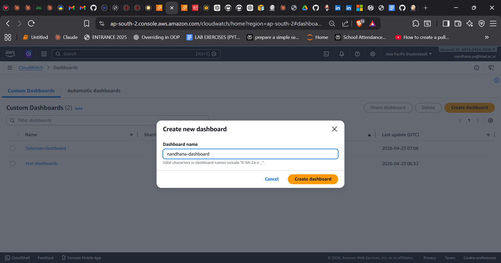
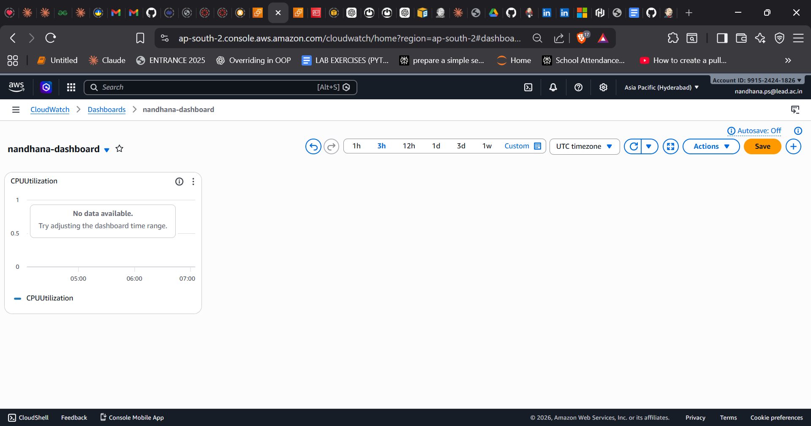
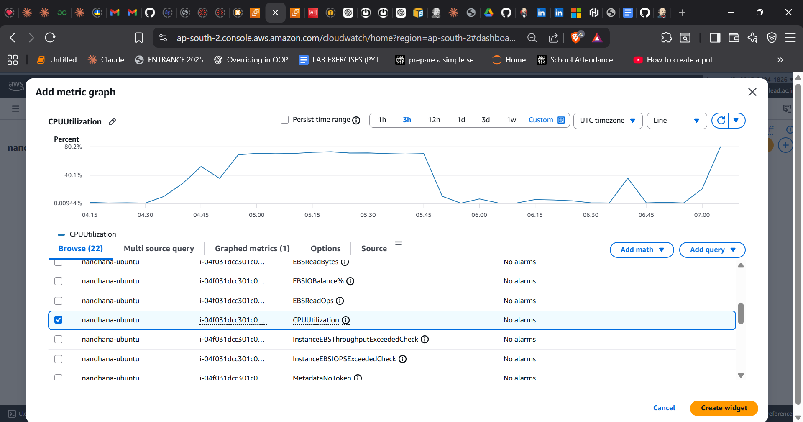
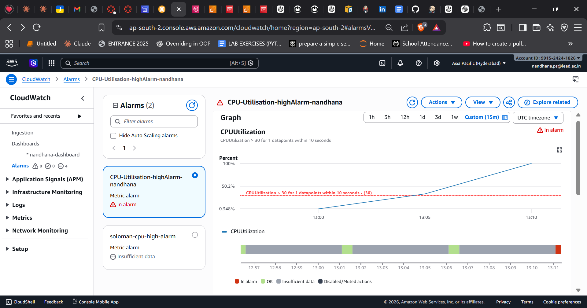
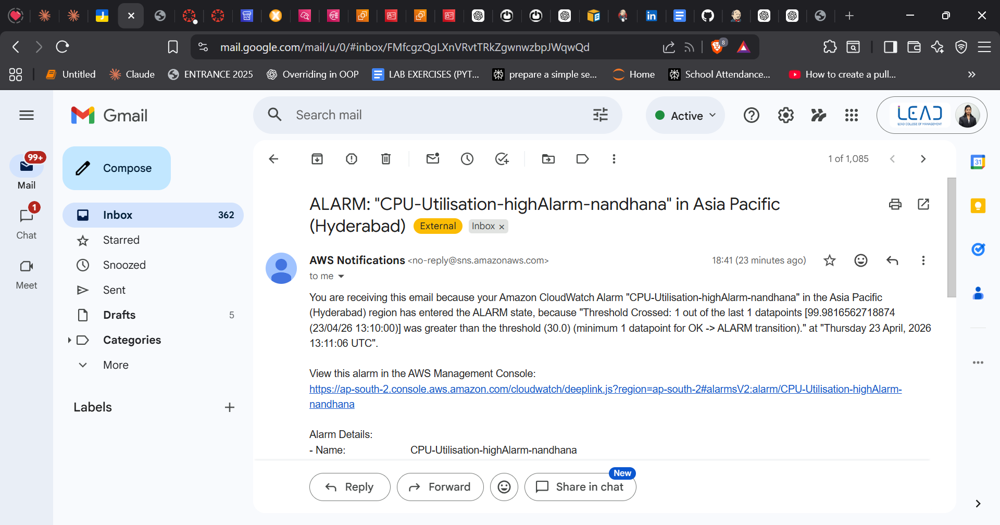

# AWS CloudWatch Dashboard & Alarm Setup

## Overview
This project demonstrates how to monitor EC2 CPU metrics using AWS CloudWatch,
create a dashboard, and set up an alarm with SNS email notifications.

---

## Prerequisites
- AWS Account
- EC2 Instance running (Ubuntu)
- SSH access to EC2
- Basic knowledge of AWS Console

---

## Steps Covered
1. Launch EC2 Instance (cw-demo)
2. Generate CPU Load using `stress` tool
3. Create CloudWatch Dashboard (demo-dashboard)
4. Create CloudWatch Alarm (cpu-high-alarm) — triggers at >70% CPU
5. Configure SNS Email Notification (cw-alert-topic)
6. Test the alarm and verify email alert

## Project Structure
```
AWS-CloudWatch-Alarm-setup/
│
├── screenshots/
│   ├── alarm-notification.png
│   ├── create-dashboard.png
│   ├── dashboard.png
│   ├── metrics-graph.png
│   └── utilisation-graph.png
│
└── README.md
```

## Step 1: Launch EC2 Instance

1. Go to **AWS Console → EC2 → Launch Instance**
2. Configure:
   - **Name:** `cw-demo`
   - **AMI:** Ubuntu Server (Latest LTS)
   - **Instance type:** `t2.micro`
   - **Key pair:** Create or use existing
   - **Security group:** Allow SSH (port 22)
3. Click **Launch Instance**

---

## Step 2: Generate CPU Load for Testing

### Connect to EC2 via SSH
```bash
ssh -i "your-key.pem" ubuntu@
```

### Update packages
```bash
sudo apt update
```

### Install stress tool
```bash
sudo apt install stress -y
```

### Run CPU load (runs for 300 seconds)
```bash
stress --cpu 2 --timeout 300
```

---

## Step 3: Create CloudWatch Dashboard

1. Go to **AWS Console → CloudWatch**
2. Click **Dashboards → Create Dashboard**
3. Enter Dashboard name: `demo-dashboard`
4. Click **Create**

### Add Widget
1. Click **Add widget**
2. Select **Line graph**
3. Click **Browse → EC2 → Per-Instance Metrics**
4. Select **CPUUtilization**
5. Choose your EC2 instance (`cw-demo`)
6. Click **Create widget**
7. Click **Save**

### Expected Result
- CPU graph with live metrics visible on the dashboard
---

## Step 4: Create CloudWatch Alarm

1. Go to **CloudWatch → Alarms**
2. Click **Create Alarm**

### Select Metric
1. Click **Select metric**
2. Choose **EC2 → Per-Instance Metrics → CPUUtilization**
3. Select your instance (`cw-demo`)
4. Click **Select metric**

### Configure Condition
- **Threshold type:** Static
- **Condition:** CPUUtilization **Greater than 70%**
- **Period:** 1 minute
- **Evaluation periods:** 2

### Configure Notification (SNS)
1. Click **Create new SNS topic**
2. Enter:
   - **Topic name:** `cw-alert-topic`
   - **Email:** `your-email@example.com`
3. Click **Create topic**
4. Go to your email and **click the confirmation link** from AWS
### Finalize Alarm
- **Alarm name:** `cpu-high-alarm`
- Click **Create alarm**
---
## Step 5: Test the Alarm

### Run CPU stress again
```bash
stress --cpu 2 --timeout 300
```
### Expected Results
- CloudWatch alarm state changes: **OK → ALARM**
- You receive an email: **"ALARM: CPU utilization high"**
---
## Step 6: Stop the Load

```bash
pkill stress
```
After stopping, alarm state returns back to **OK**.
---


## Screenshots

### Dashboard Creation


### CloudWatch Dashboard


### Metrics Graph


### CPU Utilisation Graph


### Alarm Notification


## Tools & Services Used
| Tool | Purpose |
|------|---------|
| AWS EC2 (Ubuntu, t2.micro) | Virtual machine for testing |
| AWS CloudWatch | Monitoring and dashboard |
| AWS SNS | Email alert notifications |
| stress | CPU load generation for testing |
| Git Bash | Version control & GitHub push |

---

## Author
**nandhanapsuresh**  
GitHub: [nandhanapsuresh](https://github.com/nandhanapsuresh)
